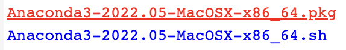
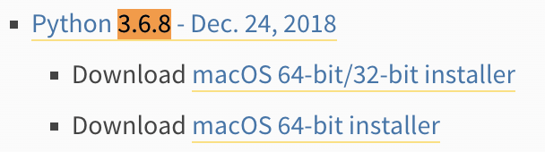
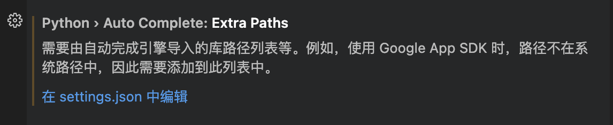
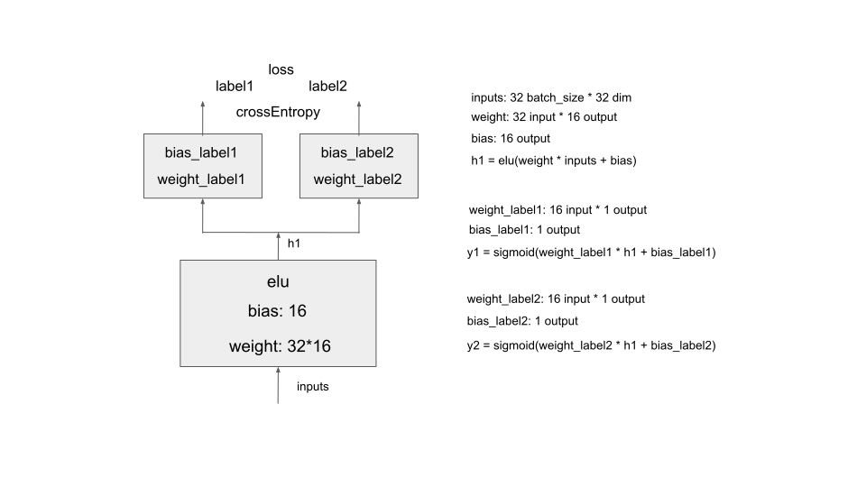

# TensorFlow 脚本工具
环境搭建（适配MAC M1 M2系列芯片）+ 模型demo + 创建/解析模型ckpt, saved_model, tfrecord文件

## 一、环境安装
### 1. anaconda选择 & python安装（for mac m1 m2）  
选择对应的版本<https://repo.anaconda.com/archive/>，注意直接在官网下载python3.11版本无法适配mac电脑arm架构芯片，需要选择MacOSX-86_64系列（python3.8，适配tf1x）
  

如果单纯安装python3.6时，若mac arm架构芯片使用python3.6有问题，可以使用：<https://www.python.org/downloads/macos/>   


### 2. 设置清华镜像源（下载速度缓慢时使用）
```// 清华源, conda config命令会在当前用户目录下创建.condarc文件```  
```conda config --add channels https://mirrors.tuna.tsinghua.edu.cn/anaconda/pkgs/free/```  
```conda config --add channels https://mirrors.tuna.tsinghua.edu.cn/anaconda/pkgs/main/```  
```// 其他附加库```  
```conda config --add channels https://mirrors.tuna.tsinghua.edu.cn/anaconda/cloud/conda-forge/```
```conda config --add channels https://mirrors.tuna.tsinghua.edu.cn/anaconda/cloud/msys2/```  
```conda config --add channels https://mirrors.tuna.tsinghua.edu.cn/anaconda/cloud/bioconda/```  
```conda config --add channels https://mirrors.tuna.tsinghua.edu.cn/anaconda/cloud/menpo/```  
```conda config --add channels https://mirrors.tuna.tsinghua.edu.cn/anaconda/cloud/pytorch/```  
  
```// 添加清华源```  
```conda config --set show_channel_urls yes```  
```// 删除清华源```  
```conda config --remove-key channels```  
  
### 3. 创建虚拟环境
```conda update --all```  
```conda remove -n tf15 --all```  
```conda create -n tf15 python=3.6```  
```conda activate tf15```  
```conda install numpy```  
```pip install mkl```
```conda install -c anaconda scikit-learn```  
```conda install pandas=1.1.5```  
```conda install tensorflow=1.15.0```   
command+shift+p输入Select Interpreter选择对应编译器  

### 4. tensorflow15 跳转问题
```mkdir ~/virtual-lib/python3.6/site-packages```  
```cd ~/virtual-lib/python3.6/site-packages```  
```ln -s ${your_anaconda_path}/anaconda3/envs/tf15/lib/python3.6/site-packages/tensorflow_core tensorflow```  
在设置中搜索“extra path"，编辑settings.json，并在python.analysis.extraPaths中加入“/Users/${your_count}/virtual-lib/python3.6/site-packages”，重启vscode即可实现tensorflow跳转  



## 二、checkpoint的生成、加载与使用
### 1. checkpoint的生成  
位置```./ckpt/generate.py```  
##### (1) 利用tensorflow的variable生成简单的MTL网络（多目标模型）   
  
##### (2) 常规global_step, optimizer等设置  
##### (3) checkpoint文件保存  

### 2. checkpoint的加载，改变以及使用（可打印分析，hack参数并快速热启动，重新加载模型继续训练等）  
位置```./ckpt/load_change_use.py```  
##### (1) 利用```load_and_change```函数，加载并打印图中变量  
##### (2) 利用```load_and_change```函数，并设置```need_change=True```可改变部分变量并重新保存。代码中事例的背景是将输入维度从32维扩展为40维时，对参数```models/weight```的输入补充了8维。事例采用glort_uniform方式，是tensorflow中常用的初始化变量的方式，此方式是在修改网络结构后实现快速热启动的方法。  
##### (3) 利用```load_and_reuse```函数，可将checkpoint图中变量加载，并重新构建新的图病继续训练。适用于加载已有模型继续训练，也可以灵活实现热启动。


## 三、saved_model的生成、加载与使用  
### 1. saved_model的生成  
位置```./saved_model/generate.py```  
##### (1) 环境安装“tensorflow_serving”：```pip install tensorflow-serving-api==1.15.0```  
##### (2) 利用tensorflow的variable生成简单的MTL网络（多目标模型）   
##### (3) 常规global_step, optimizer等设置  
##### (4) saved_model文件保存（包括variables文件夹，pb文件为固化的图结构，tf_serving_warmup_request文件是便于serving热启动的文件）  
### 2. saved_model的加载与打印 
位置```./saved_model/load.py```  
##### (1) ```print(meta_graph.signature_def["signature"].outputs)```直接打印  
##### (2) ```tf.train.write_graph(sess.graph_def, pb_file_path, 'print.pbtxt')```保存为pbtxt文件，直接查看  